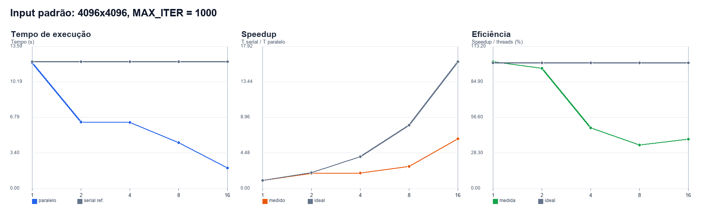
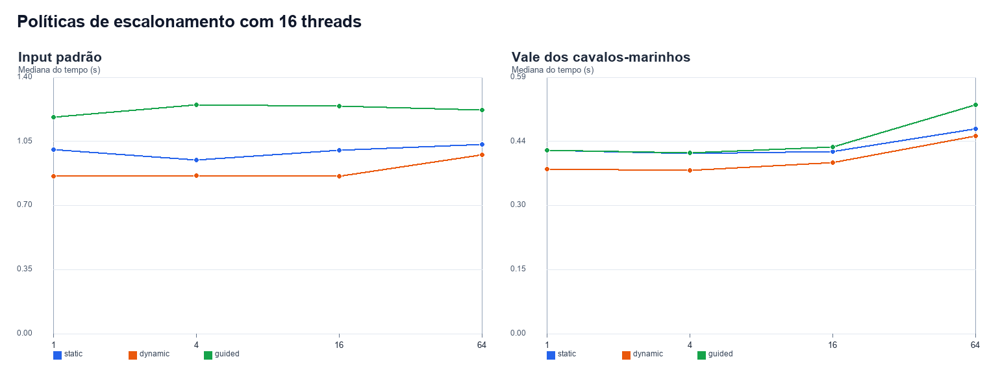
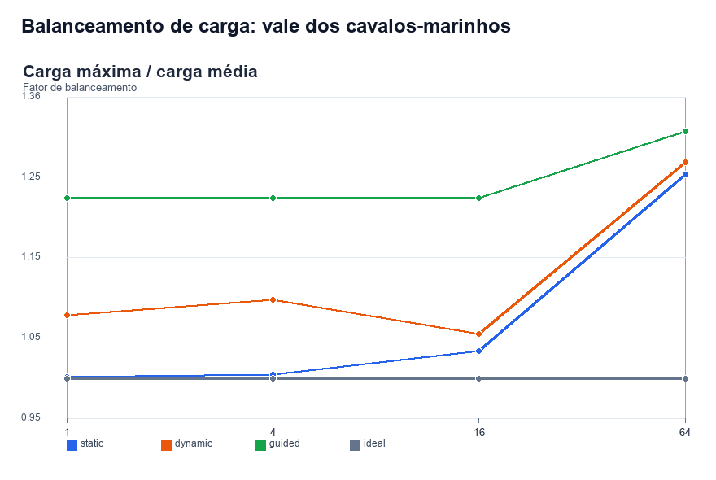

# Resultados OpenMP - Mandelbrot

## Escopo e método

Foram executadas 5 configurações de escalabilidade forte no input padrão (região completa, 4096x4096, `MAX_ITER = 1000`) e 12 combinações de política/chunk para cada input. Cada medição foi repetida três vezes; as tabelas usam a mediana. O relógio envolve somente o cálculo de escape-time e exclui leitura e escrita de arquivos.

Ambiente registrado na execução:

```text
Sistema operacional: Windows-11-10.0.26200-SP0
Processador: AMD Ryzen 7 7735HS with Radeon Graphics
Processadores lógicos detectados: 16
Compilador: Microsoft C/C++ (cl.exe), otimização /O2
OpenMP: MSVC /openmp
Medições: 3 repetições por configuração; estatística principal = mediana
```

Políticas avaliadas: `static`, `dynamic` e `guided`; chunks: 1, 4, 16 e 64 linhas. A variação do número de threads no input padrão usa `static` sem chunk explícito, isto é, blocos contíguos de linhas.

## Corretude (Seção 5.5)

O critério do enunciado permite no máximo 0,01% de pixels divergentes (1.677 de 16.777.216), cada um com diferença máxima de uma iteração. Foram comparadas as matrizes de contagem da referência sequencial e da versão paralela em 29 configurações: 29/29 aprovadas; 29/29 com igualdade exata. O maior número observado de pixels diferentes foi 0, e a maior diferença absoluta observada foi 0.

Resultado: **todas as matrizes comparadas são idênticas**. Portanto, a implementação satisfaz o critério mais forte, sem usar a tolerância.

## Input padrão - tempo, Speedup e Eficiência

Fórmulas: `Speedup(p) = mediana(T_serial) / mediana(T_paralelo,p)` e `Eficiência(p) = Speedup(p) / p`.

| Threads | T serial (s) | T paralelo (s) | Speedup | Eficiência |
| --- | --- | --- | --- | --- |
| 1 | 12.133 | 12.004 | 1.011x | 101.1% |
| 2 | 12.133 | 6.345 | 1.912x | 95.6% |
| 4 | 12.133 | 6.295 | 1.927x | 48.2% |
| 8 | 12.133 | 4.366 | 2.779x | 34.7% |
| 16 | 12.133 | 1.936 | 6.266x | 39.2% |



A linha cinza do gráfico de tempo é a mediana da referência serial; a linha azul mostra a mediana paralela em cada contagem de threads.

## Políticas de escalonamento e chunk

Com o máximo de threads disponível na máquina, a melhor combinação no input padrão foi `dynamic, chunk=4` com mediana de 0.822 s. Ela equivale a Speedup de 14.763x e Eficiência de 92.3% frente à mediana serial. No vale dos cavalos-marinhos, a melhor combinação foi `static, chunk=16` com mediana de 0.373 s (Speedup de 14.435x).

### Input padrão

| Política | Chunk | Mediana (s) | Média (s) | DP (s) |
| --- | --- | --- | --- | --- |
| static | 1 | 0.949 | 0.931 | 0.037 |
| static | 4 | 1.033 | 1.028 | 0.034 |
| static | 16 | 0.997 | 1.034 | 0.067 |
| static | 64 | 1.033 | 1.057 | 0.062 |
| dynamic | 1 | 0.825 | 0.820 | 0.011 |
| dynamic | 4 | 0.822 | 0.823 | 0.011 |
| dynamic | 16 | 0.914 | 0.916 | 0.036 |
| dynamic | 64 | 0.989 | 0.983 | 0.022 |
| guided | 1 | 1.418 | 1.460 | 0.077 |
| guided | 4 | 1.421 | 1.442 | 0.051 |
| guided | 16 | 1.418 | 1.421 | 0.006 |
| guided | 64 | 1.426 | 1.423 | 0.022 |

### Vale dos cavalos-marinhos (`MAX_ITER = 5000`)

| Política | Chunk | Mediana (s) | Média (s) | DP (s) |
| --- | --- | --- | --- | --- |
| static | 1 | 0.391 | 0.417 | 0.046 |
| static | 4 | 0.375 | 0.377 | 0.013 |
| static | 16 | 0.373 | 0.392 | 0.034 |
| static | 64 | 0.469 | 0.476 | 0.021 |
| dynamic | 1 | 0.387 | 0.387 | 0.013 |
| dynamic | 4 | 0.380 | 0.391 | 0.032 |
| dynamic | 16 | 0.421 | 0.421 | 0.021 |
| dynamic | 64 | 0.474 | 0.474 | 0.001 |
| guided | 1 | 0.477 | 0.467 | 0.031 |
| guided | 4 | 0.431 | 0.428 | 0.028 |
| guided | 16 | 0.439 | 0.429 | 0.018 |
| guided | 64 | 0.434 | 0.447 | 0.028 |



No input padrão, `dynamic` com chunks 1 e 4 foi a política mais rápida; chunks maiores aumentaram o tempo, em especial para `dynamic`. `guided` foi consistentemente mais lento neste ambiente. No caso de desbalanceamento, `static, chunk=16` e `static, chunk=4` superaram por pouco as alternativas dinâmicas. Portanto, o menor fator de carga não determina sozinho o menor tempo: a sobrecarga de agendamento e a localidade de memória também importam.

## Balanceamento de carga - vale dos cavalos-marinhos

O trabalho foi estimado pela soma das contagens de iteração atribuídas a cada thread. O fator reportado é `carga máxima / carga média`; 1,0 representa distribuição ideal. Valores maiores indicam uma thread com mais trabalho que a média.

| Política | Chunk | Carga mín. | Carga máx. | Carga média | Fator |
| --- | --- | --- | --- | --- | --- |
| static | 1 | 77,861,122 | 78,119,947 | 77,982,508 | 1.002 |
| static | 4 | 77,422,319 | 78,377,107 | 77,982,508 | 1.005 |
| static | 16 | 75,730,532 | 80,674,303 | 77,982,508 | 1.035 |
| static | 64 | 63,705,764 | 98,063,943 | 77,982,508 | 1.258 |
| dynamic | 1 | 74,299,308 | 84,244,317 | 77,982,508 | 1.080 |
| dynamic | 4 | 70,071,794 | 85,767,271 | 77,982,508 | 1.100 |
| dynamic | 16 | 73,868,623 | 82,373,871 | 77,982,508 | 1.056 |
| dynamic | 64 | 54,564,776 | 99,323,968 | 77,982,508 | 1.274 |
| guided | 1 | 66,877,142 | 95,778,118 | 77,982,508 | 1.228 |
| guided | 4 | 66,066,202 | 95,778,118 | 77,982,508 | 1.228 |
| guided | 16 | 60,058,440 | 95,778,118 | 77,982,508 | 1.228 |
| guided | 64 | 57,987,377 | 102,348,573 | 77,982,508 | 1.312 |



## Arquivos desta pasta

- `raw_timings.csv`: todas as repetições cruas.
- `summary_standard_scaling.csv`: tabelas de tempo, Speedup e Eficiência.
- `summary_scheduling.csv`: médias, medianas e desvios por política e chunk.
- `correctness.csv`: comparação da matriz paralela com a referência sequencial.
- `seahorse_load_balance.csv`: cargas por política/chunk e fator de balanceamento.
- `graficos/`: os três gráficos usados neste relatório.
